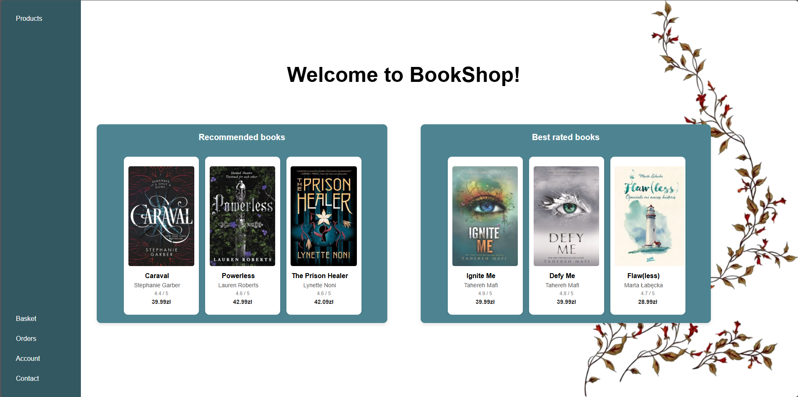
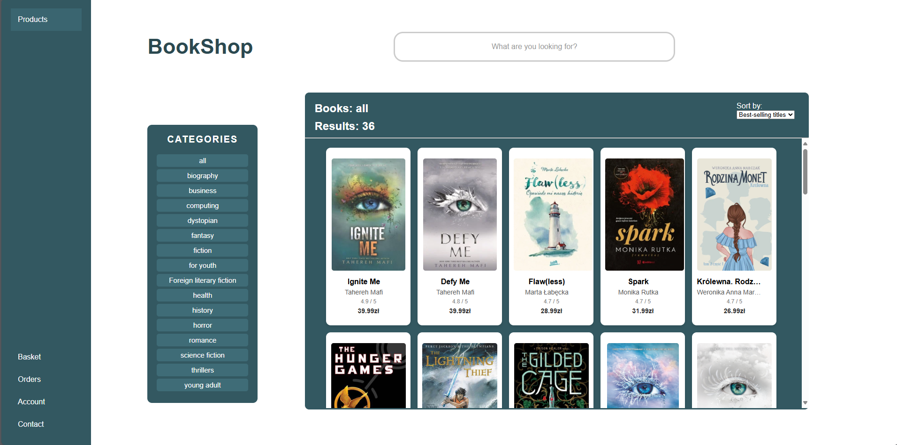
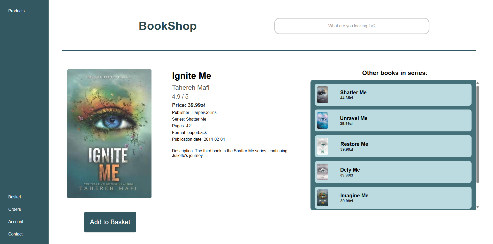
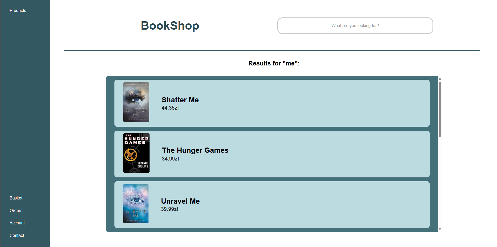
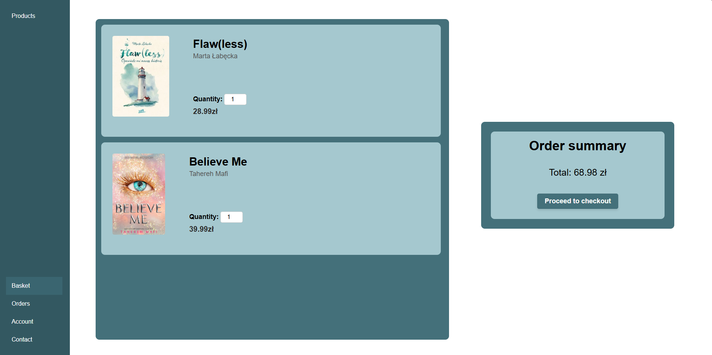
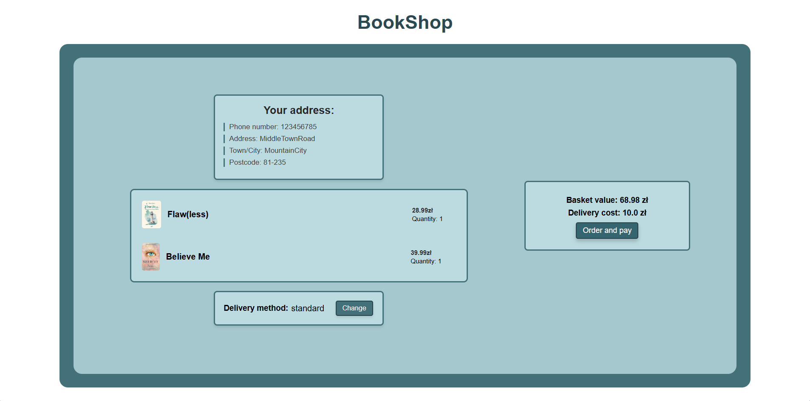
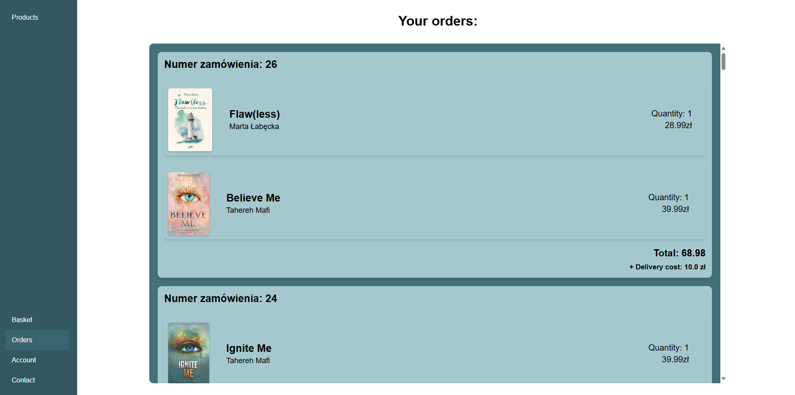

# BookShop

**BookShop** is an online bookstore web application.  
It allows users to browse and search books by title or category, add books to their basket, and place orders - without implementing a real payment system (after confirming an order, a message appears instead of an actual payment process).

---

## Login and Registration

---

## Welcome Page
After logging in, users are greeted with a welcome page displaying recommended and top-rated books.

---

## Main Page
The main page shows all available products.  
Users can filter books by category and sort them (e.g., by price or popularity).

---

## Book Page
When clicking on a specific book, the user is redirected to a detailed book page.  
It contains extended information such as description, author, price, publisher.

---

## Search Results
Books can be quickly found using the search bar.

---

## Basket
Users can add books to their basket and easily update or remove items before confirming their order.

---

## Checkout
A simple checkout form lets users confirm their order.

> 💡 Note: The payment process is simulated.  
> When clicking the **"Order and pay"** button, the system displays a confirmation message, but no real payment is processed.

---

## Orders
Users can view all their previous orders, including detailed information about each book and total prices.

---

## Features
- User registration and login
- Book browsing by category
- Book sorting options
- Book search bar
- Shopping basket
- Detailed book pages
- Simple checkout
- Order history view
- Update account information (e.g. email, password... )

---

## 🛠️ Technologies Used

- **Java**, **JSP**, **Servlets**, **JSTL**
- **HTML**, **CSS**, **JavaScript**
- **MySQL** database
- **Tomcat** server

---

## 📄 Description

This project was entirely designed and developed independently.  
It was created to demonstrate the full implementation of a functional online bookstore — from browsing and sorting books to managing orders and displaying user interactions dynamically.
